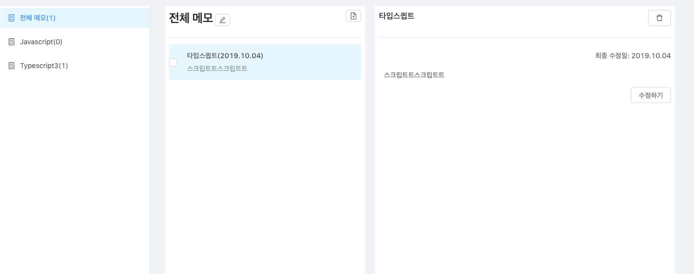

## 환경 구성
이 프로젝트는 `create-react-app`으로 만들어졌습니다.

### 폴더 구조
모든 소스코드는 `src` 경로 아래에 있습니다.

#### src/api
api 통신을 위한 코드가 있습니다.

#### src/components
페이지를 구성하는 컴포넌트들이 있습니다.
각 페이지 컴포넌트명으로 된 폴더 아래에는 해당 페이지에서 사용되는 컴포넌트가 있으며,
`shared` 폴더 아래에 공통으로 사용하는 컴포넌트가 있습니다.

#### src/modules
리덕스 구성요소가 있습니다.

#### src/pages
각 페이지의 메인이 되는 컴포넌트가 있습니다.

## 설치 및 실행
1. 패키지 설치
```
npm install
```

2. 로컬 서버 실행
```
npm start
```